# Analytics & Charts

The analytics module generates PNG charts using Matplotlib for job market insights.

## Available Charts

### Skills Analysis

#### Top Skills (All)

Most demanded skills across all job postings.

```bash
python main.py --analytics skills
```

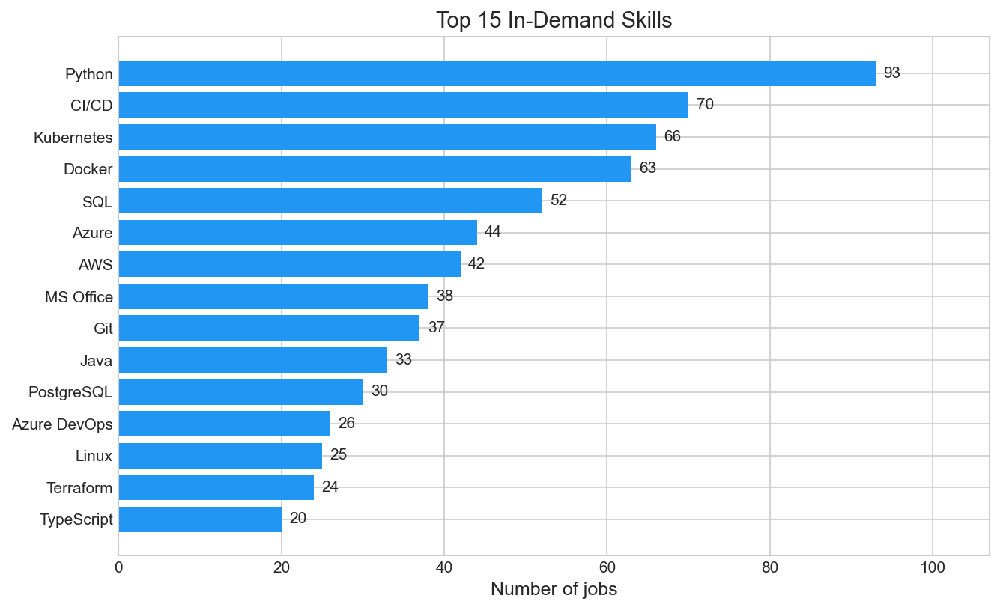

#### Top Skills by Seniority

Skills filtered by experience level.

```bash
python main.py --analytics skills --seniority junior
python main.py --analytics skills --seniority mid
python main.py --analytics skills --seniority senior
```

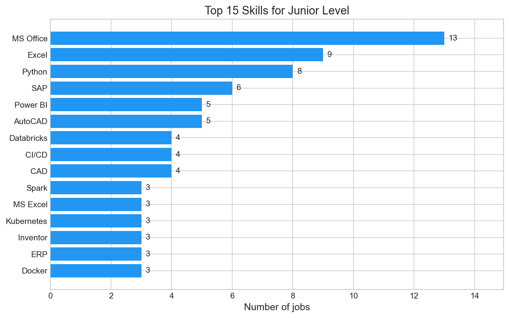
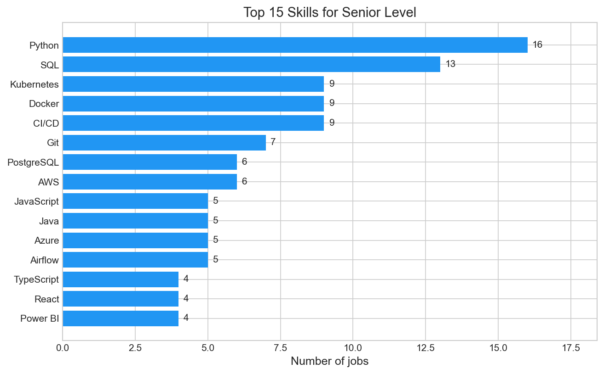

#### Top Skills by Work Mode

Skills for remote, hybrid, or on-site positions.

```bash
python main.py --analytics skills --work-mode remote
python main.py --analytics skills --work-mode hybrid
```


#### Skills Comparison

Side-by-side comparison between two seniority levels.

```bash
python main.py --compare junior senior
python main.py --compare mid lead
```

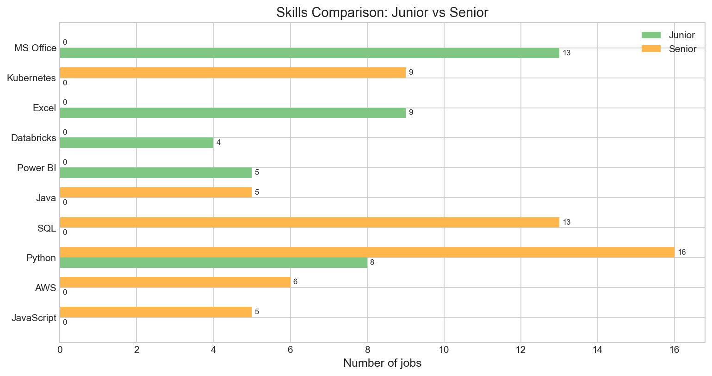

---

### Location Analysis

#### Top Locations

Jobs distribution by location.

```bash
python main.py --analytics locations
```

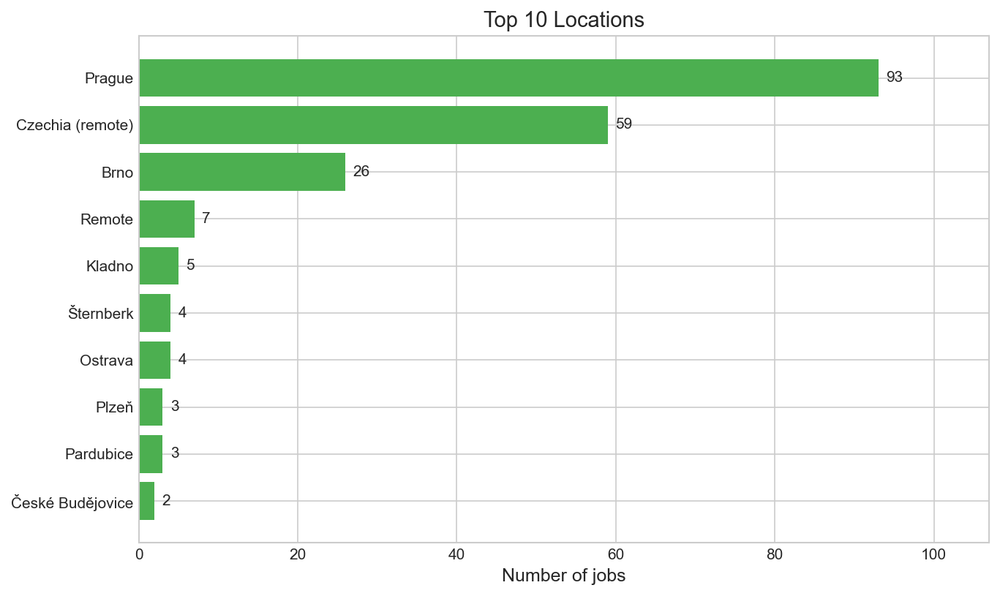

---

### Company Analysis

#### Top Hiring Companies

Companies with most job postings.

```bash
python main.py --analytics companies
```

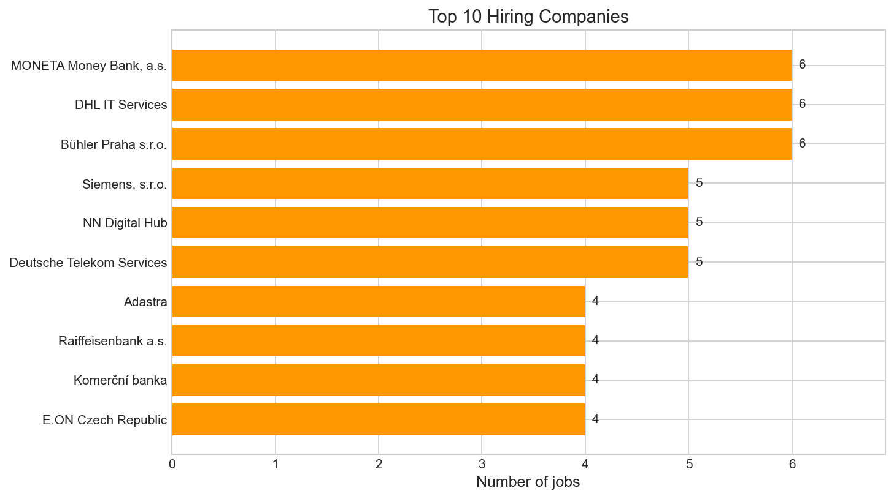

---

### Seniority Analysis

#### Seniority Distribution

Pie chart showing junior/mid/senior/lead distribution.

```bash
python main.py --analytics seniority
```

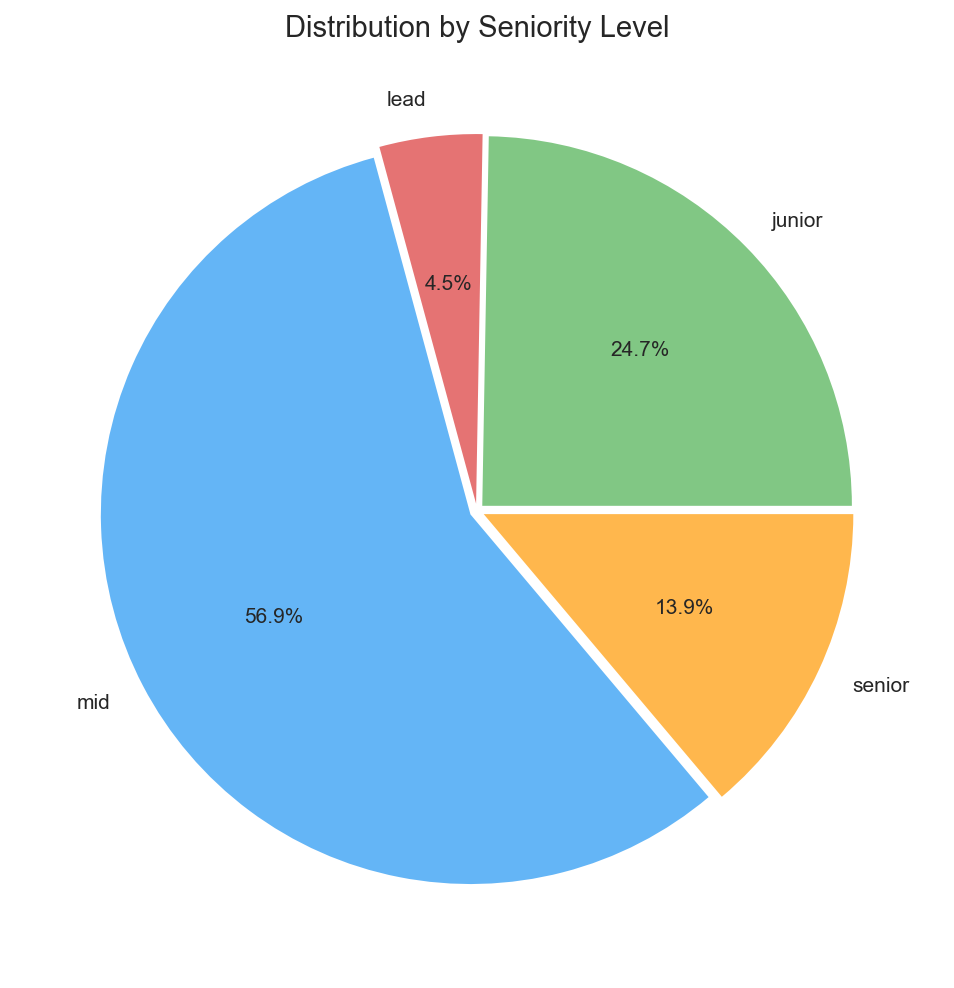

---

### Work Mode Analysis

#### Work Mode Distribution

Remote vs Hybrid vs On-site distribution.

```bash
python main.py --analytics workmode
```

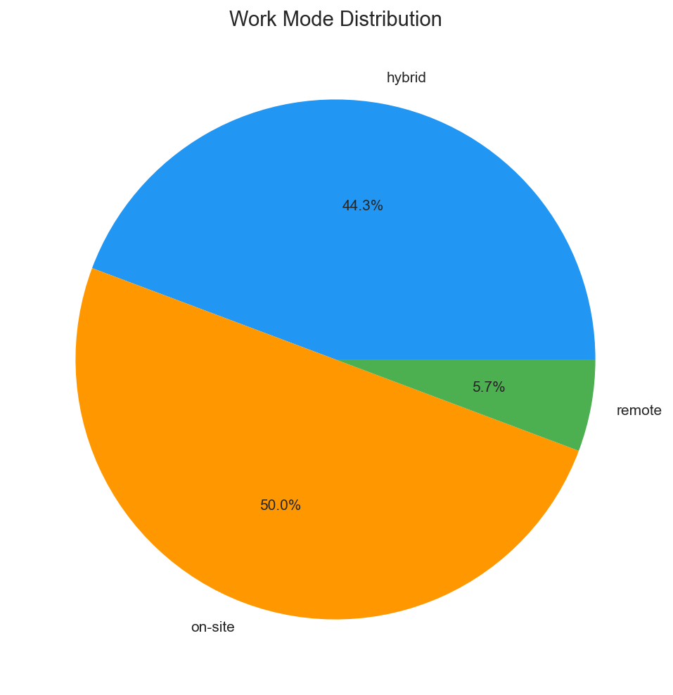

---

### Salary Analysis

#### Salary by Seniority

Average salary comparison across experience levels.

```bash
python main.py --analytics salary
```

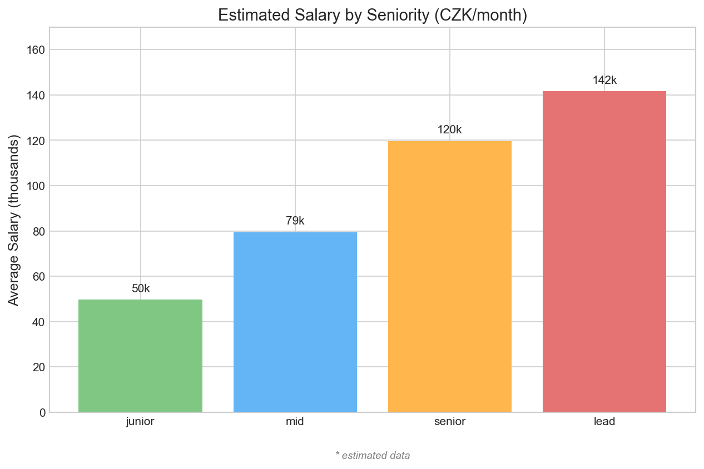

#### Salary by Work Mode

Average salary comparison by work mode.

```bash
python main.py --analytics salary_workmode
```


---

### Combined Analysis

#### Seniority/Work Mode Heatmap

Matrix showing job count by seniority and work mode.

```bash
python main.py --analytics heatmap
```

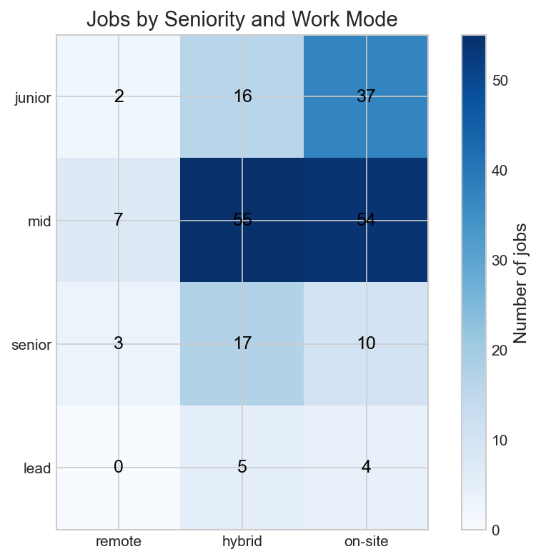

---

### Timeline Analysis

#### Jobs Over Time

New jobs posted over the last 30 days.

```bash
python main.py --analytics timeline
```

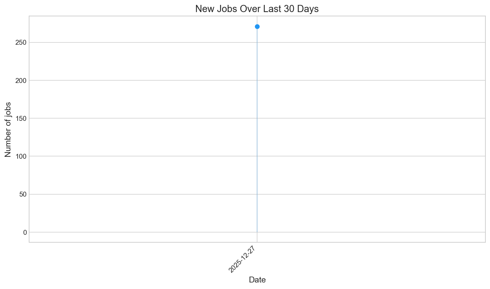

---

### Other Charts

#### Top Requirements

Most common requirements across jobs.

```bash
python main.py --analytics requirements
```

#### Top Benefits

Most common benefits offered.

```bash
python main.py --analytics benefits
```

---

## Generate All Charts

```bash
python main.py --analytics
```

This generates all charts and saves to `reports/charts/`.

## Output

Charts are saved as PNG files:

```
reports/charts/
├── top_skills_2025-01-01_12-00-00.png
├── top_skills_senior_2025-01-01_12-00-00.png
├── locations_2025-01-01_12-00-00.png
├── top_companies_2025-01-01_12-00-00.png
├── seniority_2025-01-01_12-00-00.png
├── work_mode_2025-01-01_12-00-00.png
├── salary_by_seniority_2025-01-01_12-00-00.png
├── salary_by_work_mode_2025-01-01_12-00-00.png
├── seniority_workmode_heatmap_2025-01-01_12-00-00.png
├── jobs_timeline_2025-01-01_12-00-00.png
└── skills_comparison_junior_vs_senior_2025-01-01_12-00-00.png
```

## Chart Settings

| Parameter | Value |
|-----------|-------|
| DPI | 150 |
| Style | seaborn-v0_8-whitegrid |
| Font Size | 10 |
| Title Size | 14 |
| Background | White |

## Color Scheme

| Chart Type | Color |
|------------|-------|
| Skills | #2196F3 (Blue) |
| Locations | #4CAF50 (Green) |
| Companies | #FF9800 (Orange) |
| Seniority | Gradient (Green → Red) |
| Work Mode | Green/Blue/Orange |

## Summary Statistics

Text summary is also generated:

```
*Job Market Statistics*

Jobs: 112 active, 0 archived
Companies: 78
Skills: 413

Top Skills: CI/CD, Kubernetes, Docker
Top Location: Prague
Avg Salary: 86,376 CZK/month

By Status:
  active: 110
  new: 2
```
