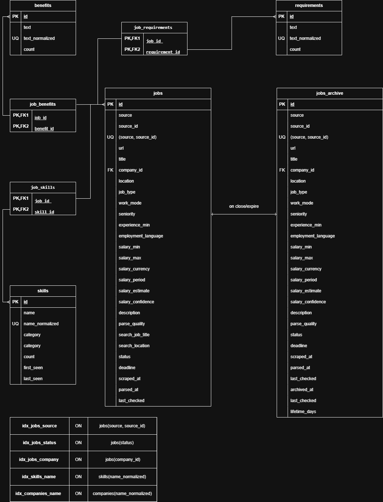

# Database Schema

SQLite database with normalized structure for job postings, companies, skills, requirements, and benefits.

## ERD Diagram



## Tables

### jobs

Main table storing job postings.

```sql
CREATE TABLE jobs (
    id INTEGER PRIMARY KEY AUTOINCREMENT,
    source TEXT NOT NULL,                    -- "jobs.cz"
    source_id TEXT NOT NULL,                 -- Original ID from source
    url TEXT,
    
    title TEXT,
    company_id INTEGER,                      -- FK → companies
    location TEXT,
    job_type TEXT,                           -- full-time|part-time|contract|internship|temporary
    work_mode TEXT,                          -- on-site|hybrid|remote
    seniority TEXT,                          -- junior|mid|senior|lead
    experience_min INTEGER,
    employment_language TEXT,                -- Czech|English|Mixed
    
    salary_min REAL,
    salary_max REAL,
    salary_currency TEXT,
    salary_period TEXT,                      -- hour|day|month|year
    salary_estimate REAL,                    -- LLM estimated salary
    salary_confidence REAL,                  -- 0.0-1.0
    
    description TEXT,                        -- JSON array
    parse_quality REAL DEFAULT 0,            -- 0.0-1.0
    
    status TEXT DEFAULT 'new',               -- new|active|expired|closed
    deadline DATE,
    scraped_at DATETIME,
    parsed_at DATETIME,
    last_checked DATETIME,
    
    UNIQUE(source, source_id),
    FOREIGN KEY (company_id) REFERENCES companies(id)
)
```

### jobs_archive

Archived jobs (closed/expired).

```sql
CREATE TABLE jobs_archive (
    id INTEGER PRIMARY KEY,                  -- Same ID as in jobs
    source TEXT NOT NULL,
    source_id TEXT NOT NULL,
    url TEXT,
    
    -- Same fields as jobs --
    
    archived_at DATETIME,
    close_reason TEXT,                       -- expired|closed|404|duplicate
    lifetime_days INTEGER,                   -- Days job was active
    
    FOREIGN KEY (company_id) REFERENCES companies(id)
)
```

### companies

```sql
CREATE TABLE companies (
    id INTEGER PRIMARY KEY AUTOINCREMENT,
    name TEXT NOT NULL,
    name_normalized TEXT NOT NULL UNIQUE,    -- Lowercase for deduplication
    count INTEGER DEFAULT 1,                 -- Number of jobs
    first_seen DATE,
    last_seen DATE
)
```

### skills

```sql
CREATE TABLE skills (
    id INTEGER PRIMARY KEY AUTOINCREMENT,
    name TEXT NOT NULL,
    name_normalized TEXT NOT NULL UNIQUE,
    category TEXT,                           -- language|framework|tool|cloud|database
    count INTEGER DEFAULT 1,
    first_seen DATE,
    last_seen DATE
)
```

### requirements

```sql
CREATE TABLE requirements (
    id INTEGER PRIMARY KEY AUTOINCREMENT,
    text TEXT NOT NULL,
    text_normalized TEXT NOT NULL UNIQUE,
    count INTEGER DEFAULT 1
)
```

### benefits

```sql
CREATE TABLE benefits (
    id INTEGER PRIMARY KEY AUTOINCREMENT,
    text TEXT NOT NULL,
    text_normalized TEXT NOT NULL UNIQUE,
    count INTEGER DEFAULT 1
)
```

## Junction Tables (M:N Relations)

### job_skills

```sql
CREATE TABLE job_skills (
    job_id INTEGER,
    skill_id INTEGER,
    PRIMARY KEY (job_id, skill_id),
    FOREIGN KEY (job_id) REFERENCES jobs(id),
    FOREIGN KEY (skill_id) REFERENCES skills(id)
)
```

### job_requirements

```sql
CREATE TABLE job_requirements (
    job_id INTEGER,
    requirement_id INTEGER,
    PRIMARY KEY (job_id, requirement_id),
    FOREIGN KEY (job_id) REFERENCES jobs(id),
    FOREIGN KEY (requirement_id) REFERENCES requirements(id)
)
```

### job_benefits

```sql
CREATE TABLE job_benefits (
    job_id INTEGER,
    benefit_id INTEGER,
    PRIMARY KEY (job_id, benefit_id),
    FOREIGN KEY (job_id) REFERENCES jobs(id),
    FOREIGN KEY (benefit_id) REFERENCES benefits(id)
)
```

## Indexes

```sql
CREATE INDEX idx_jobs_source ON jobs(source, source_id);
CREATE INDEX idx_jobs_status ON jobs(status);
CREATE INDEX idx_jobs_company ON jobs(company_id);
CREATE INDEX idx_skills_name ON skills(name_normalized);
CREATE INDEX idx_companies_name ON companies(name_normalized);
```

## Relationships

| Relationship | Type | Description |
|--------------|------|-------------|
| companies → jobs | 1:N | One company has many jobs |
| skills ↔ jobs | M:N | Skills shared across jobs |
| requirements ↔ jobs | M:N | Requirements shared across jobs |
| benefits ↔ jobs | M:N | Benefits shared across jobs |
| jobs → jobs_archive | 1:1 | Job moved on close/expire |

## Key Queries

### Get top skills

```sql
SELECT name, count 
FROM skills 
ORDER BY count DESC 
LIMIT 15;
```

### Get jobs by seniority

```sql
SELECT j.*, c.name as company_name
FROM jobs j
LEFT JOIN companies c ON j.company_id = c.id
WHERE j.seniority = 'senior'
ORDER BY j.scraped_at DESC;
```

### Get skills for specific seniority

```sql
SELECT s.name, COUNT(*) as count
FROM skills s
JOIN job_skills js ON s.id = js.skill_id
JOIN jobs j ON js.job_id = j.id
WHERE j.seniority = 'senior'
GROUP BY s.name
ORDER BY count DESC
LIMIT 15;
```

### Get average salary by seniority

```sql
SELECT seniority, 
       AVG(COALESCE(salary_estimate, (salary_min + salary_max) / 2)) as avg_salary,
       COUNT(*) as count
FROM jobs
WHERE seniority IS NOT NULL 
  AND (salary_estimate IS NOT NULL OR salary_min IS NOT NULL)
GROUP BY seniority
ORDER BY avg_salary;
```

### Sync jobs from listing

```sql
-- Check existing
SELECT id, source_id FROM jobs 
WHERE source = ? AND status IN ('new', 'active');

-- Update existing
UPDATE jobs SET last_checked = ?, status = 'active' 
WHERE source = ? AND source_id = ?;

-- Archive closed
INSERT INTO jobs_archive 
SELECT *, ?, ?, ? FROM jobs WHERE id = ?;
DELETE FROM jobs WHERE id = ?;
```

### Low quality jobs

```sql
SELECT * FROM jobs 
WHERE parse_quality < 0.5 
ORDER BY parse_quality ASC;
```

## Job Lifecycle

```
┌─────────┐     ┌─────────┐     ┌─────────┐     ┌──────────────┐
│   new   │────▶│  active │────▶│ expired │────▶│ jobs_archive │
└─────────┘     └─────────┘     └─────────┘     └──────────────┘
     │                │              │
     │                │              │
     │                ▼              │
     │          ┌─────────┐         │
     └─────────▶│  closed │─────────┘
                └─────────┘
```

| Status | Description |
|--------|-------------|
| new | Just scraped, not yet verified |
| active | Verified on subsequent scrape |
| expired | Past deadline date |
| closed | Not found in listing (removed by employer) |

## Statistics Query

```sql
SELECT 
    (SELECT COUNT(*) FROM jobs) as total_jobs,
    (SELECT COUNT(*) FROM jobs_archive) as archived_jobs,
    (SELECT COUNT(*) FROM companies) as total_companies,
    (SELECT COUNT(*) FROM skills) as total_skills,
    (SELECT COUNT(*) FROM requirements) as total_requirements,
    (SELECT COUNT(*) FROM benefits) as total_benefits;
```
