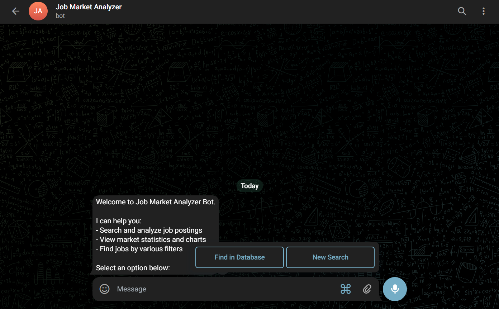
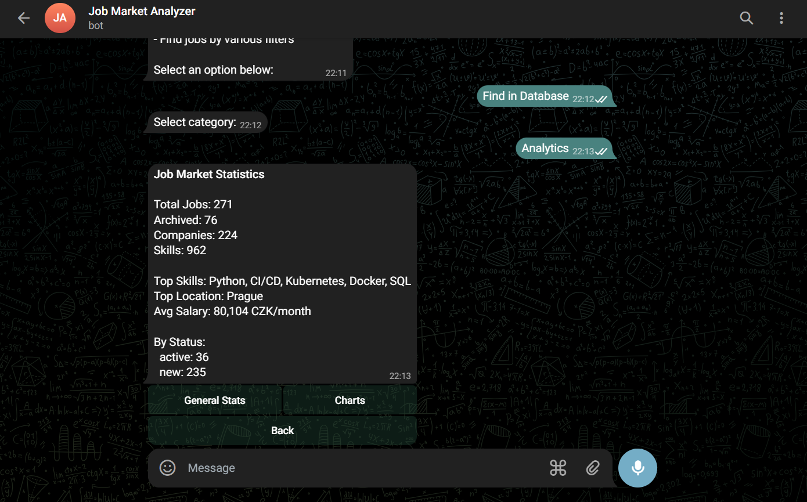
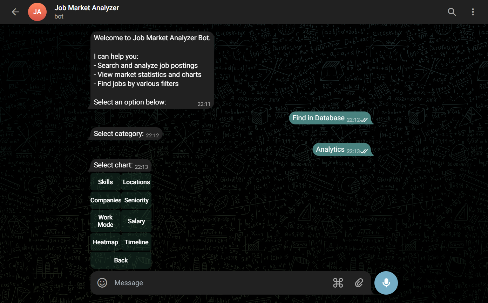
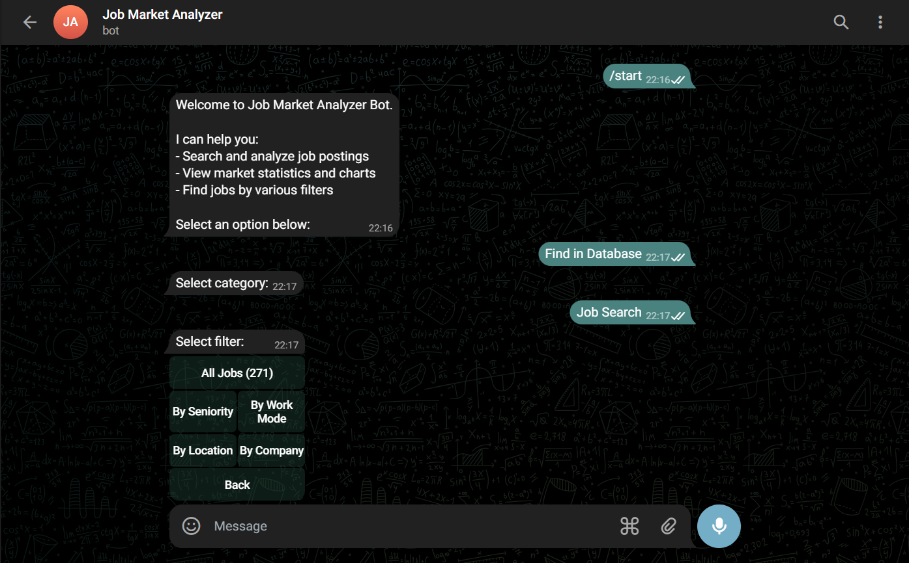
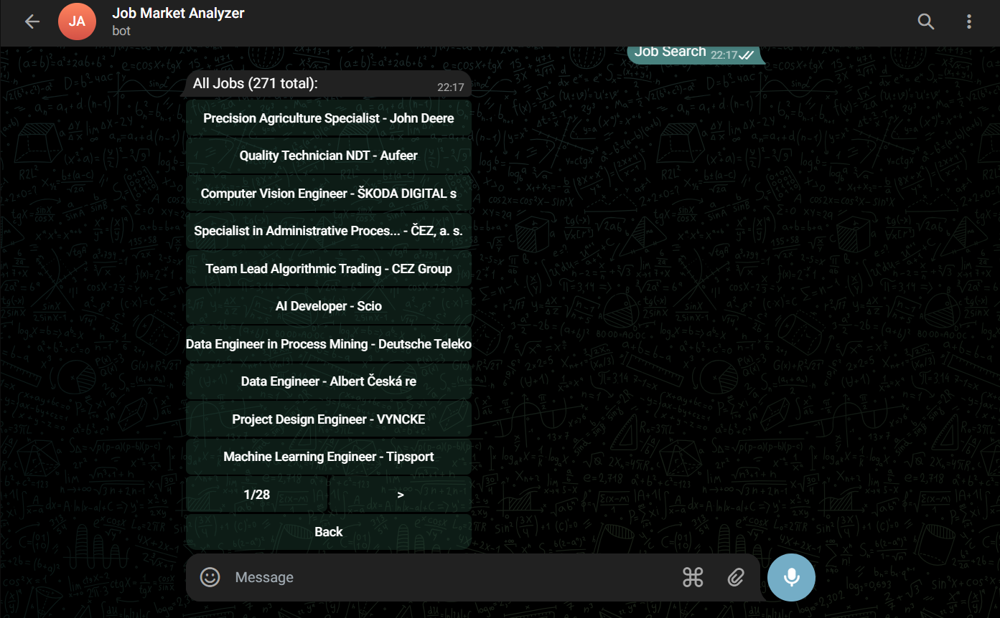
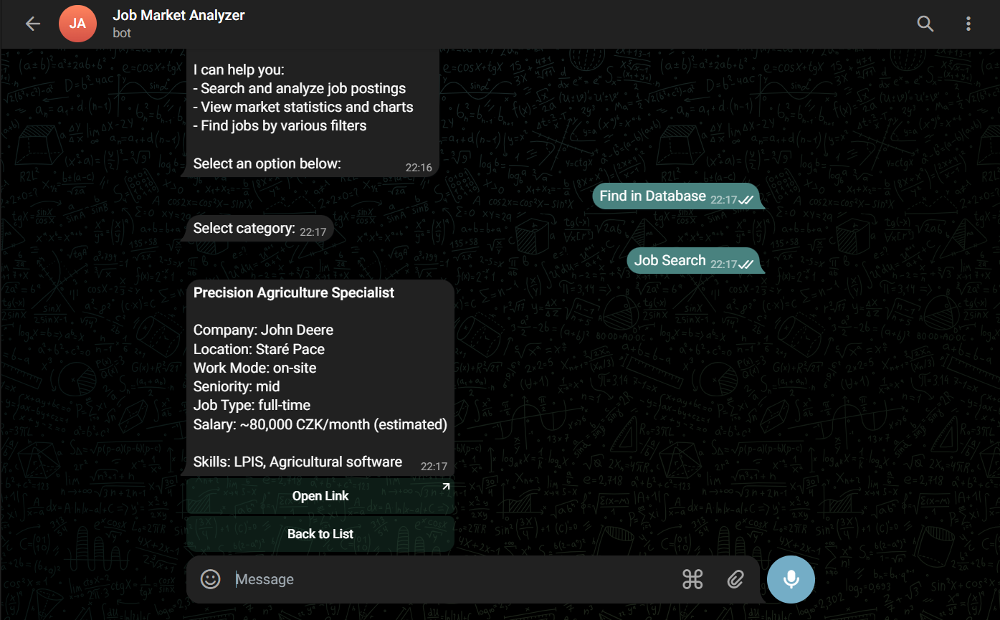

# Telegram Bot

Telegram bot for accessing job market analytics and searching jobs.

## Setup

### 1. Create Bot

1. Open Telegram, find **@BotFather**
2. Send `/newbot`
3. Enter bot name: `Job Market Analyzer`
4. Enter username: `job_market_analyzer_bot`
5. Copy the token

### 2. Configure

Add to `.env`:

```
TELEGRAM_BOT_TOKEN=7123456789:AAHxxxxxxxxxxxxxxxxxxxxxxxx
```

### 3. Run

```bash
python bot.py
```

### 4. Set Commands (Optional)

In BotFather → Edit Bot → Edit Commands:

```
start - Main menu
help - Help message
```

## Bot Structure

```
/start
    │
    ▼
┌─────────────────────────────────────┐
│  [Find in Database]  [New Search]   │  ← Reply Keyboard
└─────────────────────────────────────┘
         │                    │
         │                    ▼
         │              Enter job title
         │                    │
         │                    ▼
         │              Enter location
         │                    │
         │                    ▼
         │              Scraping...
         │                    │
         ▼                    │
┌─────────────────────────────────────┐
│  [Analytics]  [Job Search]  [Back]  │  ← Reply Keyboard
└─────────────────────────────────────┘
         │              │
         ▼              ▼
    Analytics      Job Filters
```

## Features

### Main Menu



| Button | Action |
|--------|--------|
| Find in Database | Browse existing data |
| New Search | Scrape new jobs |

### New Search

Start a new scraping job:

1. Enter job title (e.g., "DevOps", "Python Developer")
2. Enter location (e.g., "Praha", "Brno", "Remote")
3. Wait for scraping (5-15 minutes)
4. Receive results summary


### Analytics



| Option | Description |
|--------|-------------|
| General Stats | Text statistics |
| Charts | Chart selection |

#### General Stats

```
Job Market Statistics

Total Jobs: 112
Archived: 0
Companies: 78
Skills: 413

Top Skills: CI/CD, Kubernetes, Docker
Top Location: Prague
Avg Salary: 86,376 CZK/month

By Status:
  active: 110
  new: 2
```

#### Charts



Available charts:

| Chart | Description |
|-------|-------------|
| Skills (All) | Top skills overall |
| Skills (Junior) | Top skills for junior |
| Skills (Mid) | Top skills for mid |
| Skills (Senior) | Top skills for senior |
| Locations | Jobs by location |
| Companies | Top hiring companies |
| Seniority | Junior/Mid/Senior distribution |
| Work Mode | Remote/Hybrid/On-site |
| Salary by Seniority | Salary comparison |
| Salary by Work Mode | Salary by work mode |
| Heatmap | Seniority × Work Mode matrix |
| Timeline | Jobs over time |
| Compare Junior/Senior | Skills comparison |

### Job Search



#### Filters

| Filter | Description |
|--------|-------------|
| All Jobs | Browse all jobs |
| By Seniority | Junior / Mid / Senior / Lead |
| By Work Mode | Remote / Hybrid / On-site |
| By Location | Prague / Brno / etc. |
| By Company | Top hiring companies |

#### Job List



- Paginated (10 per page)
- Navigation: `<` Previous, `>` Next
- Click job to see details

#### Job Details



```
*Senior DevOps Engineer*

Company: Siemens, s.r.o.
Location: Prague
Work Mode: hybrid
Seniority: senior
Salary: ~120,000 CZK/month (estimated)

Skills: Docker, Kubernetes, AWS, Terraform, CI/CD

[Open Link]
[Back to List]
```

## Navigation

| Button | Action |
|--------|--------|
| Back | Return to previous menu |
| Back to List | Return to job list |
| `<` / `>` | Pagination |
| Open Link | Open job URL in browser |

## Error Handling

- Invalid input → Prompt to retry
- Scraping error → Error message with details
- Empty results → "No jobs found" message

## Files

| File | Description |
|------|-------------|
| `bot.py` | Main bot code |
| `.env` | Bot token configuration |
