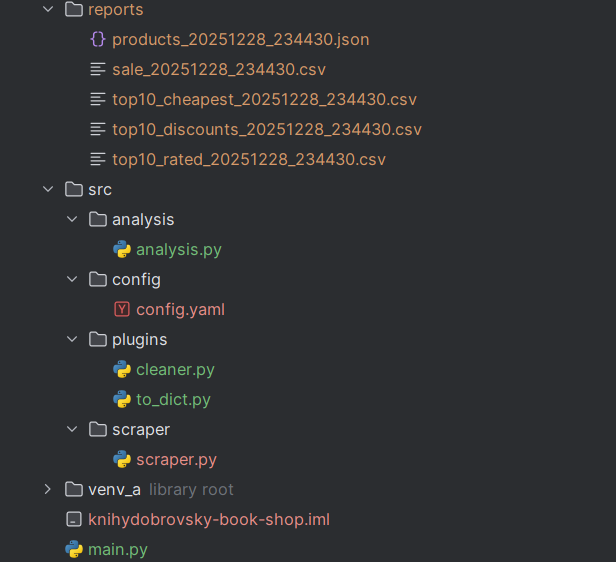
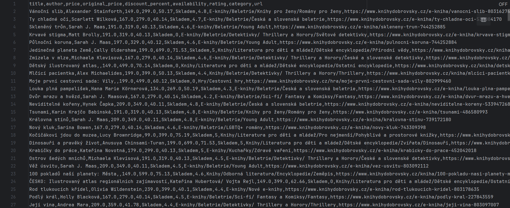
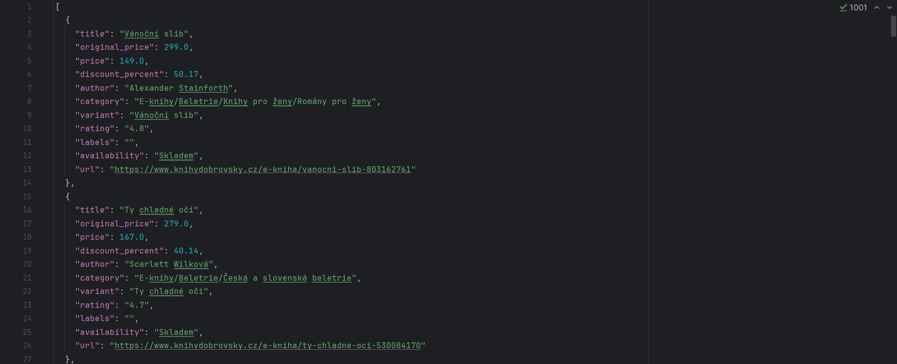

# Knihy Dobrovský Book Shop Scraper

A Python web scraper for monitoring competitor book prices from knihydobrovsky.cz. Extracts product data from embedded JSON attributes, handles invalid JSON formatting, and generates analytical reports for business decision-making.

## Overview

This scraper collects book catalog data from Knihy Dobrovský, a major Czech online bookstore. It demonstrates handling of real-world challenges like malformed JSON data, price extraction from multiple sources, and Czech character encoding.

**Key metrics:**
- Target: 200+ bestseller books
- Runtime: ~5-10 minutes
- Output: CSV + JSON + analytical reports

---

## Features

### Core Functionality
- Extracts data from `data-productinfo` JSON attributes
- Repairs invalid JSON (unquoted string values)
- Parses accurate prices from HTML elements
- Handles pagination across categories
- Removes duplicate products

### Data Analysis
- Calculates discount percentages
- Identifies sale products
- Generates Top-10 reports (discounts, ratings)
- UTF-8 support for Czech characters

### Reliability
- Rate limiting (0.5 req/sec)
- Exponential backoff retry
- Circuit breaker pattern
- Comprehensive error handling

---

## Project Structure



---

## Installation

### Prerequisites
- Python 3.9 or higher
- pip package manager

### Setup

1. Clone the repository:
```bash
git clone <repository-url>
cd knihydobrovsky-book-shop
```

2. Create virtual environment:
```bash
python -m venv venv

# Windows
venv\Scripts\activate

# Linux/Mac
source venv/bin/activate
```

3. Install dependencies:
```bash
pip install -r requirements.txt
```

---

## Configuration

HTTP client settings in `configs/knihydobrovsky_config.yaml`:

```yaml
client:
  base_url: "https://www.knihydobrovsky.cz"
  
rate_limit:
  requests_per_second: 0.5
  requests_per_minute: 25
  
delays:
  request_delay: 2.0
  jitter: 1.0
  
retry:
  max_attempts: 3
  backoff_factor: 2
```

---

## Usage

### Basic Command
```bash
python main.py
```

### Example Output

**Terminal:**
```
Fetching bestsellery page 1...
Found 24 products
Fetching bestsellery page 2...
Found 24 products
...
Total products collected: 217
Duplicates removed: 5
Generating reports...
✓ products_20251228_143052.json
✓ sale_20251228_143052.csv
✓ top10_discounts_20251228_143052.csv
✓ top10_rated_20251228_143052.csv
```

---

## Output Examples

### CSV Output (sale products)



```csv
title,author,price,original_price,discount_percent,availability,rating
Šikmý kostel,Karin Lednická,269.0,349.0,22.92,Skladem,4.8
Les v domě,Alena Mornštajnová,299.0,429.0,30.30,Skladem,4.6
```

### JSON Output



```json
{
    "title": "Vánoční slib",
    "original_price": 299.0,
    "price": 149.0,
    "discount_percent": 50.17,
    "author": "Alexander Stainforth",
    "category": "E-knihy/Beletrie/Knihy pro ženy/Romány pro ženy",
    "variant": "Vánoční slib",
    "rating": "4.8",
    "labels": "",
    "availability": "Skladem",
    "url": "https://www.knihydobrovsky.cz/e-kniha/vanocni-slib-803162761"
}
```
---

## Technical Details

### JSON Repair

The website embeds product data in `data-productinfo` attributes with invalid JSON:

```html
<li data-productinfo='{"id": 803031659, "name": Manželství, "price": 499.00}'>
```

**Problem:** String values lack quotes.

**Solution:**
```python
import re
import json

def parse_product_info(raw: str) -> dict:
    fixed = re.sub(
        r'"(\w+)"\s*:\s*([^",\[\]{}][^"\n]*?)(?=,\s*"\w+"\s*:|,?\s*})',
        r'"\1": "\2"',
        raw
    )
    return json.loads(fixed)
```	

---

## HTTP Client

Built on [http-client-core](https://github.com/Git-Dalv/http-client-core) with:
- Automatic retry with exponential backoff
- Rate limiting (token bucket)
- Circuit breaker for fault tolerance
- User-Agent rotation
- YAML configuration

---

## Dependencies

```
requests>=2.31.0
beautifulsoup4>=4.12.0
pandas>=2.0.0
pyyaml>=6.0
http-client-core @ git+https://github.com/Git-Dalv/http-client-core.git # [all]
text-cleaner @ git+https://github.com/Git-Dalv/http-client-core

```
