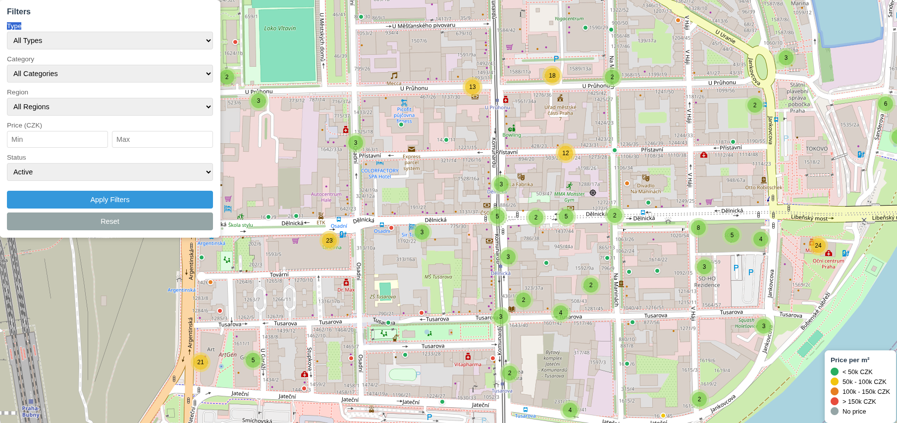
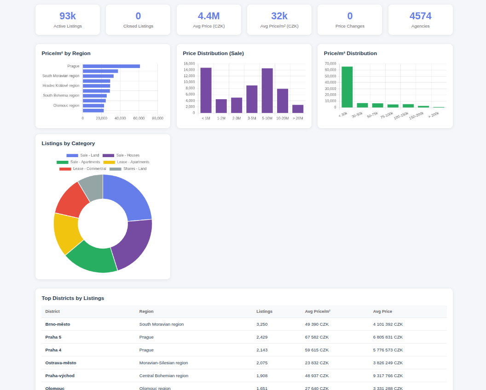

# Sreality Monitor

Real estate monitoring system for Czech Republic's largest property portal [Sreality.cz](https://www.sreality.cz).

## Overview

This project scrapes property listings from Sreality API, stores them in SQLite database with price history tracking, and provides:

- Interactive map with 90,000+ properties
- Analytics dashboard with charts
- Telegram bot for search and notifications
- Price change tracking

## Features

- **Data Collection**: REST API scraper with pagination and rate limiting
- **Database**: Normalized SQLite schema with 9 tables
- **Price Tracking**: Historical price changes with timestamps
- **Interactive Map**: Leaflet.js with clustering and filters
- **Analytics**: Statistics, charts (matplotlib), web dashboard (Chart.js)
- **Telegram Bot**: Search, subscriptions, notifications

## Tech Stack

| Component | Technology |
|-----------|------------|
| Language | Python 3.9+ |
| HTTP Client | [http-client-core](https://github.com/Git-Dalv/http-client-core) |
| Database | SQLite |
| Map | Leaflet.js + MarkerCluster |
| Charts | matplotlib, Chart.js |
| Bot | python-telegram-bot |

## Installation

### 1. Clone Repository

```bash
git clone https://github.com/your-username/sreality-monitor.git
cd sreality-monitor
```

### 2. Create Virtual Environment

```bash
python -m venv venv
source venv/bin/activate  # Linux/Mac
# or
venv\Scripts\activate     # Windows
```

### 3. Install Dependencies

```bash
pip install -r requirements.txt
```

### 4. Install http-client-core

```bash
pip install git+https://github.com/Git-Dalv/http-client-core.git
```

## Usage

### Full Scrape

```bash
python main.py
```

This will:
1. Initialize database schema
2. Load reference data (regions, categories)
3. Scrape all listings (~90,000)
4. Export map data
5. Export analytics
6. Generate charts

### View Map

```bash
cd src/plugins/web
python -m http.server 8000
```

Open http://localhost:8000/index.html

### View Dashboard

Open http://localhost:8000/dashboard.html

### Generate Charts Only

```bash
python -m src.analysis.charts
```

### Run Telegram Bot

```bash
cd telegram_bot
cp .env.example .env
# Edit .env and add your bot token
python bot.py
```

## Configuration

### HTTP Client (src/configs/config.yaml)

```yaml
base_url: "https://www.sreality.cz"
timeout: 30
retry:
  max_attempts: 3
  backoff_factor: 1.0
headers:
  User-Agent: "Mozilla/5.0..."
```

### Scraper Parameters

In `main.py`:
```python
get_all_data(db, step=1000, delay=0.5)
```

- `step`: Items per request (max 1000)
- `delay`: Seconds between requests

## API Reference

### Sreality REST API

```
Base URL: https://www.sreality.cz/api/v1

GET /estates/filter_page?lang=cs
    Returns: regions, categories, districts

GET /estates/search?locality_region_id={id}&limit={n}&offset={o}&lang=cs
    Returns: property listings with pagination
```

### Pagination Strategy

Sreality API has 10,000 offset limit. To get all ~90,000 listings:

1. Split by region (14 regions)
2. If region > 10,000 listings, split by category
3. Fetch each segment with pagination

## Project Structure

```
sreality-monitor/
|-- main.py              # Entry point
|-- export_map.py        # Map export
|-- src/
|   |-- configs/         # YAML configuration
|   |-- database/        # SQLite operations
|   |-- scraper/         # API scraper
|   |-- analysis/        # Analytics & charts
|   |-- plugins/web/     # Map & dashboard
|-- telegram_bot/        # Telegram bot
|-- docs/                # Documentation
```

## Documentation

- [API Documentation](docs/API.md)
- [Database Schema](docs/DATABASE.md)
- [Analytics Guide](docs/ANALYTICS.md)
- [Telegram Bot](docs/BOT.md)
- [Technical Specification](docs/SPECIFICATION.md)

## Screenshots

### Interactive Map


### Analytics Dashboard


### Telegram Bot


## Results

| Metric | Value |
|--------|-------|
| Properties | ~90,000 |
| Images | ~1,300,000 |
| Regions | 14 |
| Districts | 77 |
| Agencies | ~3,000 |
| Database | ~150 MB |

## License

MIT License - for educational and portfolio purposes.

## Acknowledgments

- [Sreality.cz](https://www.sreality.cz) - Data source
- [Leaflet.js](https://leafletjs.com) - Interactive maps
- [OpenStreetMap](https://www.openstreetmap.org) - Map tiles
