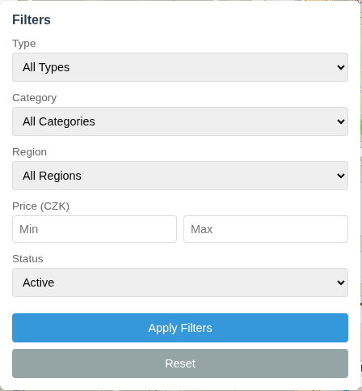
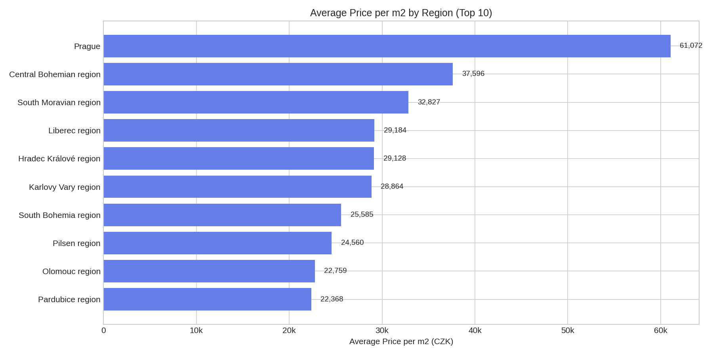
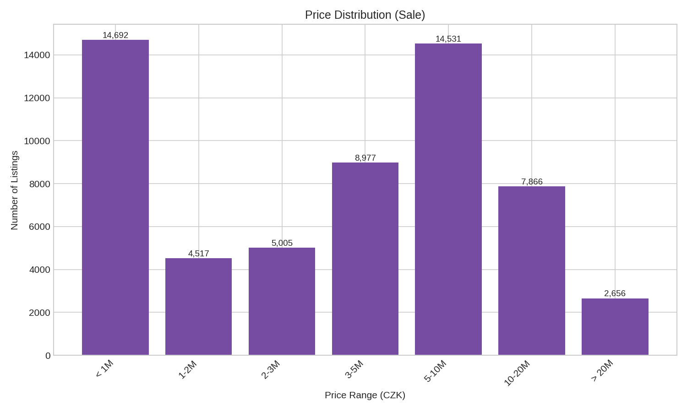
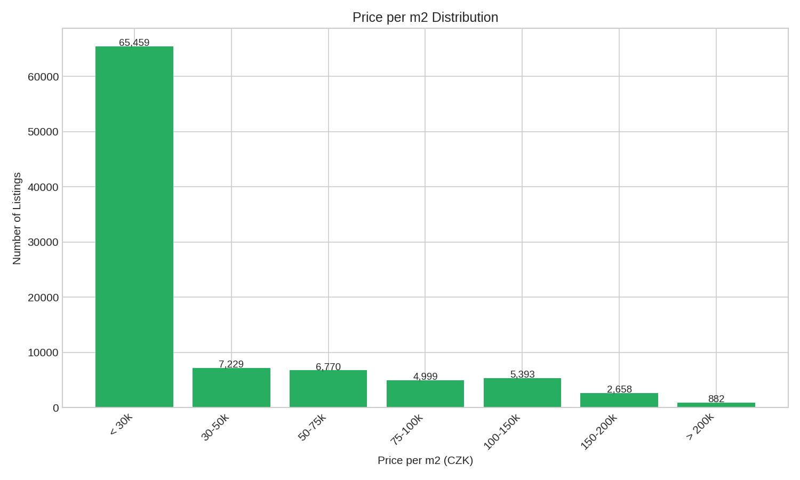
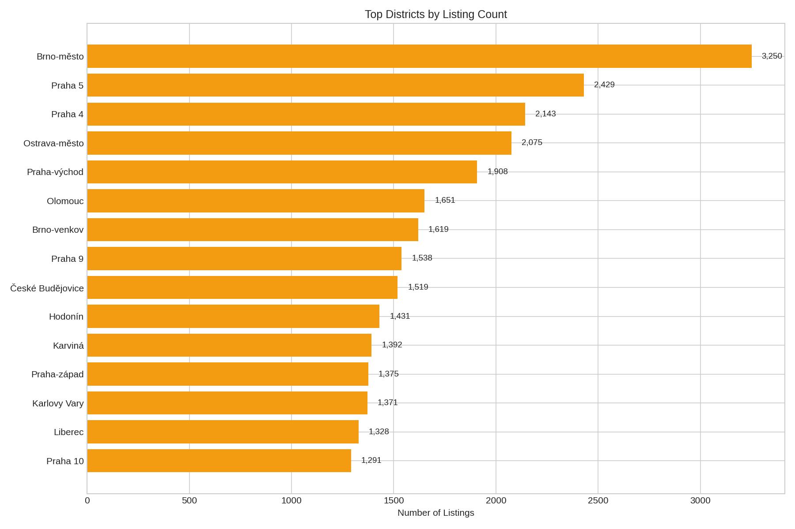
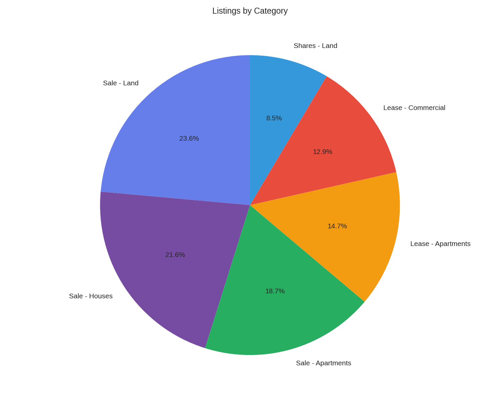
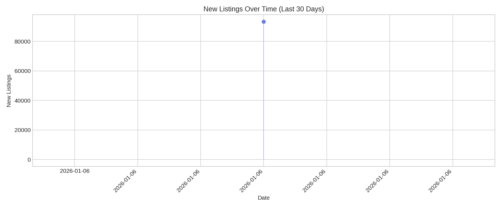
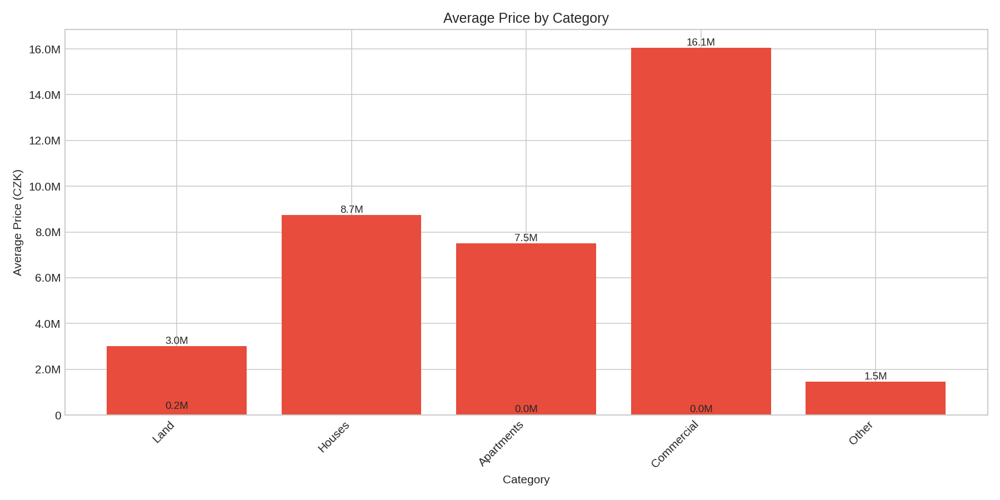

# Analytics & Visualization

This project provides multiple ways to analyze and visualize real estate data.

## Overview

| Component | Technology | Output |
|-----------|------------|--------|
| Interactive Map | Leaflet.js | HTML |
| Dashboard | Chart.js | HTML |
| Charts | matplotlib | PNG |
| Reports | Python | JSON, Console |

---

## Interactive Map

### Features

- 90,000+ property markers
- Marker clustering for performance
- Color-coded by price per m2
- Filter panel
- Property popups with details
- Direct links to Sreality

### Screenshot


### Color Coding

| Color | Price per m2 |
|-------|--------------|
| Green | < 50,000 CZK |
| Yellow | 50,000 - 100,000 CZK |
| Orange | 100,000 - 150,000 CZK |
| Red | > 150,000 CZK |
| Gray | No price data |

### Filters

| Filter | Options |
|--------|---------|
| Type | Sale / Rent |
| Category | Flat / House / Land / Commercial / Other |
| Region | 14 Czech regions |
| Price | Min / Max range |
| Status | Active / Closed |

### Usage

```bash
cd web
python -m http.server 8000
```

Open http://localhost:8000/index.html

### Screenshot: Map Filters



---

## Analytics Dashboard

Web-based dashboard with Chart.js visualizations.

### Screenshot


### Components

| Section | Description |
|---------|-------------|
| Summary Cards | Active, Closed, Avg Price, Price/m2, Changes, Agencies |
| Price by Region | Horizontal bar chart (top 10) |
| Price Distribution | Histogram of sale prices |
| Price/m2 Distribution | Histogram of prices per m2 |
| Category Chart | Doughnut chart by property type |
| Top Districts | Table with listings count |
| Price Changes | Recent price modifications |

### Usage

Open http://localhost:8000/dashboard.html

---

## Matplotlib Charts

Generated PNG images for reports and Telegram bot.

### Generate Charts

```bash
python -m src.analysis.charts
```

Output directory: `analysis/charts/`

### Available Charts

#### 1. Price per m2 by Region

**File:** `price_per_m2_by_region.png`



Horizontal bar chart showing average price per m2 for top 10 regions.

#### 2. Price Distribution

**File:** `price_distribution.png`



Histogram of property prices (sale) in ranges:
- < 1M, 1-2M, 2-3M, 3-5M, 5-10M, 10-20M, > 20M CZK

#### 3. Price per m2 Distribution

**File:** `price_per_m2_distribution.png`



Histogram of price per m2 in ranges:
- < 30k, 30-50k, 50-75k, 75-100k, 100-150k, 150-200k, > 200k CZK

#### 4. Top Districts

**File:** `top_districts.png`



Horizontal bar chart of districts with most listings.

#### 5. Category Distribution

**File:** `category_distribution.png`



Pie chart showing breakdown by property type and transaction.

#### 6. New Listings Timeline

**File:** `new_listings_timeline.png`



Line chart of new listings over last 30 days.

#### 7. Price by Category

**File:** `price_by_category.png`



Bar chart of average price by property category.

---

## JSON Analytics

### Export

```bash
python -c "from src.analysis import export_analytics; from src.database.db import Database; db=Database(); db.connect(); export_analytics(db)"
```

### Output: analytics.json

```json
{
  "generated_at": "2026-01-07T15:30:00",
  "summary": {
    "total_active": 90497,
    "total_closed": 0,
    "avg_price": 8543210,
    "avg_price_m2": 98765,
    "min_price": 100000,
    "max_price": 500000000,
    "total_price_changes": 0,
    "total_agencies": 3021
  },
  "price_by_region": [...],
  "price_by_category": [...],
  "price_distribution": {...},
  "top_districts": [...],
  "listings_dynamics": {...},
  "price_changes": [...],
  "new_listings": {...}
}
```

---

## Console Report

### Run

```bash
python -c "from src.analysis import print_summary; from src.database.db import Database; db=Database(); db.connect(); print_summary(db)"
```

### Output

```
============================================================
SREALITY ANALYTICS
============================================================

SUMMARY
   Active listings: 90,497
   Closed listings: 0
   Avg price: 8,543,210 CZK
   Avg price/m2: 98,765 CZK
   Price changes tracked: 0
   Real estate agencies: 3,021

TOP REGIONS BY PRICE/m2
   Praha: 156,789 CZK/m2 (25,432 listings)
   Jihomoravsky kraj: 89,456 CZK/m2 (12,345 listings)
   Stredocesky kraj: 78,123 CZK/m2 (10,234 listings)
   ...

TOP DISTRICTS BY LISTINGS
   Praha-zapad (Stredocesky kraj): 5,432 listings
   Brno-mesto (Jihomoravsky kraj): 4,321 listings
   ...

BY CATEGORY
   Prodej - Byt: 45,678 (avg 5,432,100 CZK)
   Prodej - Dum: 23,456 (avg 8,765,400 CZK)
   ...

NEW LISTINGS (last 7 days): 1,234

============================================================
```

---

## Data Flow

```
Sreality API
     |
     v
+----------+
| Scraper  |
+----------+
     |
     v
+----------+
| SQLite   |
+----------+
     |
     +----------------+----------------+
     |                |                |
     v                v                v
+---------+    +-----------+    +------------+
| Map     |    | Dashboard |    | Charts     |
| (HTML)  |    | (HTML)    |    | (PNG)      |
+---------+    +-----------+    +------------+
     |                |                |
     +----------------+----------------+
                      |
                      v
              +---------------+
              | Telegram Bot  |
              +---------------+
```

---

## Screenshots to Add

### Map
1. `map.png` - Full map view with markers
2. `map_filters.png` - Filter panel expanded

### Dashboard
3. `dashboard.png` - Full dashboard view

### Charts (copy from analysis/charts/)
4. `price_per_m2_by_region.png`
5. `price_distribution.png`
6. `price_per_m2_distribution.png`
7. `top_districts.png`
8. `category_distribution.png`
9. `new_listings_timeline.png`
10. `price_by_category.png`
