# Telegram Bot

Telegram bot for searching properties, viewing analytics, and receiving notifications.

## Setup

### 1. Create Bot

1. Open Telegram, find **@BotFather**
2. Send `/newbot`
3. Enter bot name: `Sreality Monitor`
4. Enter username: `sreality_monitor_bot`
5. Copy the token

### 2. Configure

```bash
cd telegram_bot
cp .env.example .env
```

Edit `.env`:
```
TELEGRAM_BOT_TOKEN=7123456789:AAHxxxxxxxxxxxxxxxxxxxxxxxx
```

### 3. Install Dependencies

```bash
pip install python-telegram-bot python-dotenv
```

### 4. Run

```bash
python bot.py
```

### 5. Set Commands in BotFather

Send to @BotFather:
```
start - Main menu
help - Help
search - Search properties
stats - Statistics
subscribe - Subscriptions
my_subscriptions - My subscriptions
```

## Bot Structure

```
/start
    |
    v
+------------------------------------------+
|  [Search]  [Analytics]  [Subscriptions]  |
|              [Map]                       |
+------------------------------------------+
        |           |              |
        v           v              v
    Filters    Statistics    Notifications
```

## Features

### Main Menu

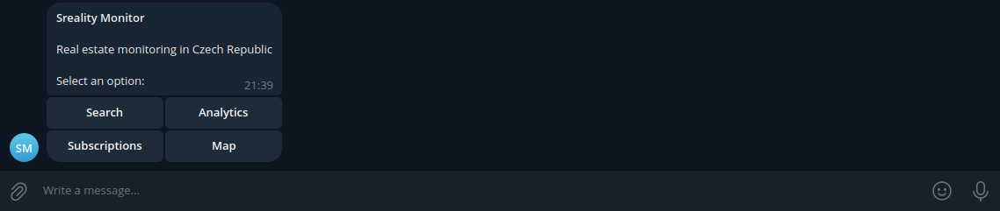

| Button | Description |
|--------|-------------|
| Search | Search properties with filters |
| Analytics | Statistics and charts |
| Subscriptions | Notification settings |
| Map | Link to web map |

### Search

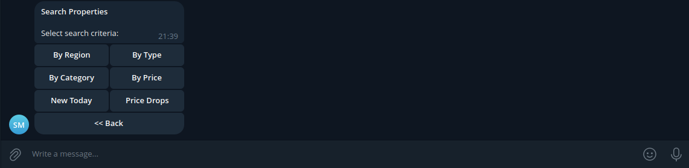

| Filter | Description |
|--------|-------------|
| By Region | Select from 14 regions |
| By Type | Sale / Rent |
| By Category | Flat / House / Land / Commercial |
| By Price | Price ranges |
| New Today | Listings added today |
| Price Drops | Recent price reductions |

### Property List

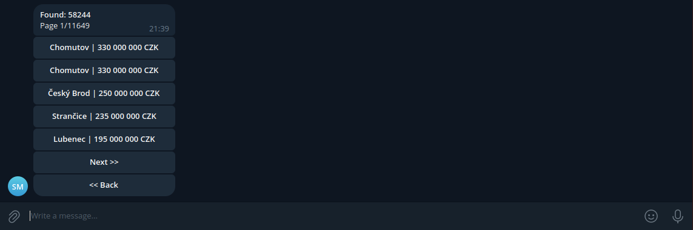

- Paginated results (5 per page)
- Shows city and price
- Navigation: Prev / Next
- Click to view details

### Property Details

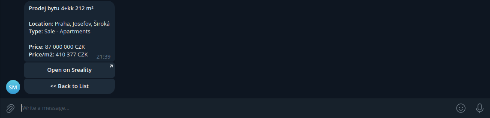

```
*Prodej bytu 2+kk, Praha*

*Location:* Praha, Zizkov
*Type:* Prodej - Byt

*Price:* 6,200,000 CZK
*Price/m2:* 121,569 CZK

[Open on Sreality]
[<< Back to List]
```

### Analytics

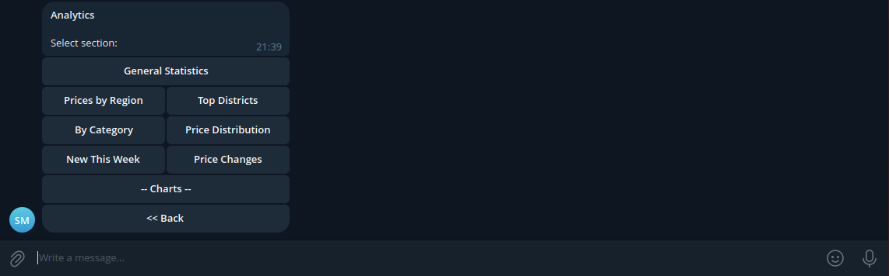

| Option | Description |
|--------|-------------|
| General Statistics | Total listings, avg price |
| Prices by Region | Top 10 regions by price/m2 |
| Top Districts | Districts with most listings |
| By Category | Breakdown by property type |
| Price Distribution | Text histogram |
| New This Week | Recent additions |
| Price Changes | Recent price modifications |
| Charts | Matplotlib images |

### Charts

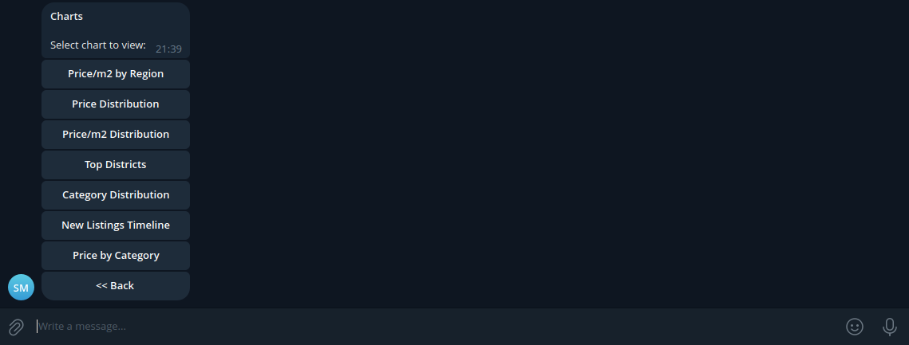

Available charts:

| Chart | Description |
|-------|-------------|
| Price/m2 by Region | Horizontal bar chart |
| Price Distribution | Histogram |
| Price/m2 Distribution | Histogram |
| Top Districts | Horizontal bar chart |
| Category Distribution | Pie chart |
| New Listings Timeline | Line chart |
| Price by Category | Bar chart |

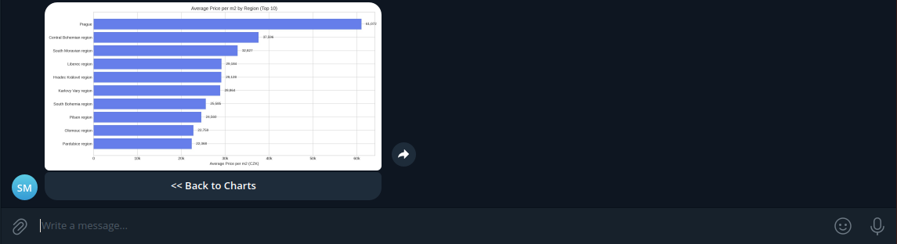

### Subscriptions

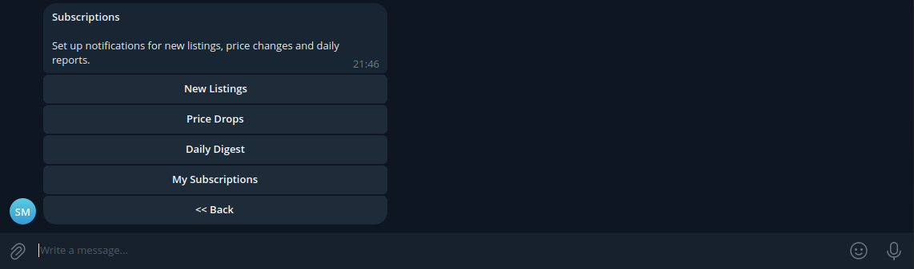

| Type | Description |
|------|-------------|
| New Listings | Alerts for new properties |
| Price Drops | Alerts when price decreases |
| Daily Digest | Summary report at 09:00 |

### New Listings Subscription

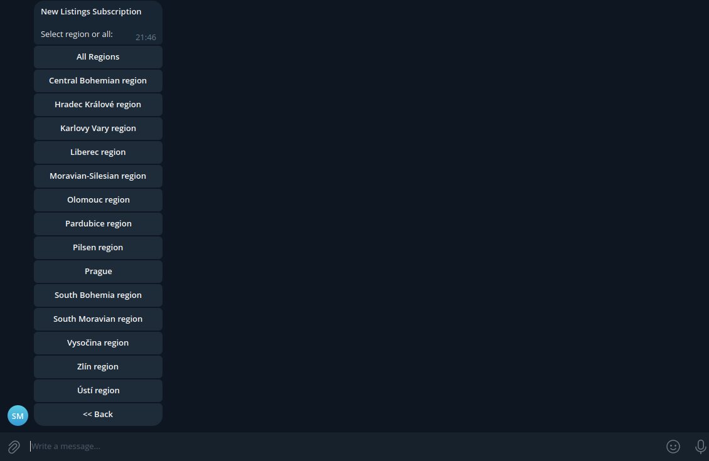

- Select specific region or all regions
- Receive alerts when new properties match

### Price Drop Subscription

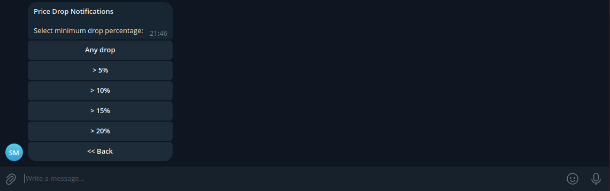

- Set minimum percentage: 1%, 5%, 10%, 15%, 20%
- Alerts only when drop exceeds threshold

### My Subscriptions

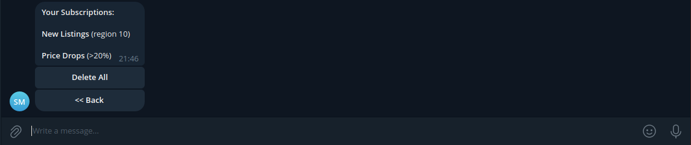

```
*Your Subscriptions:*

*New Listings* (region 10)

*Price Drops* (>10%)

*Daily Digest* at 09:00
```

## Notification Examples

### New Listing Alert

```
*New Listings* (5)

- Prodej bytu 2+kk, 51 m2
  Praha | 6,200,000 CZK

- Prodej domu, 150 m2
  Brno | 8,500,000 CZK

...and 3 more
```

### Price Drop Alert

```
*Price Drops* (3)

- Byt 3+1, Vinohrady
  Praha | -12.5%
  ~4,500,000~ > *3,937,500* CZK

- Rodinny dum
  Plzen | -8.3%
  ~6,000,000~ > *5,500,000* CZK
```

### Daily Digest

```
*Daily Digest*
_07.01.2026_

*Statistics:*
  - Active: 90,497
  - New today: 156
  - Price changes: 23

*Recent Price Changes:*
  - Praha: -5.2%
  - Brno: +2.1%
  - Ostrava: -3.8%
```

## Files

| File | Description |
|------|-------------|
| `bot.py` | Main bot entry point |
| `handlers/search.py` | Search functionality |
| `handlers/analytics.py` | Statistics and charts |
| `handlers/subscriptions.py` | Subscription management |
| `services/notifications.py` | Alert sending service |
| `data/subscriptions.json` | User subscriptions storage |

## Integration

### Send Notifications After Scraping

Add to `main.py`:

```python
import asyncio
import os
from telegram_bot.services.notifications import run_notifications

# After scraping completes
asyncio.run(run_notifications(
    bot_token=os.getenv("TELEGRAM_BOT_TOKEN"),
    new_estates=new_estates_list,
    price_changes=price_changes_list
))
```

### Daily Digest via Cron

```bash
# Every day at 09:00
0 9 * * * cd /path/to/project && python -c "
import asyncio
from telegram_bot.services.notifications import run_daily_digest
asyncio.run(run_daily_digest('YOUR_BOT_TOKEN'))
"
```

## Screenshots to Add

1. `bot_main.png` - Main menu with 4 buttons
2. `bot_search.png` - Search menu with filter options
3. `bot_list.png` - Property list with pagination
4. `bot_details.png` - Single property details
5. `bot_analytics.png` - Analytics menu
6. `bot_charts.png` - Charts selection menu
7. `bot_chart_example.png` - Example chart image in chat
8. `bot_subscriptions.png` - Subscriptions menu
9. `bot_sub_new.png` - Region selection for new listings
10. `bot_sub_price.png` - Percentage selection for price drops
11. `bot_my_subs.png` - Active subscriptions list
